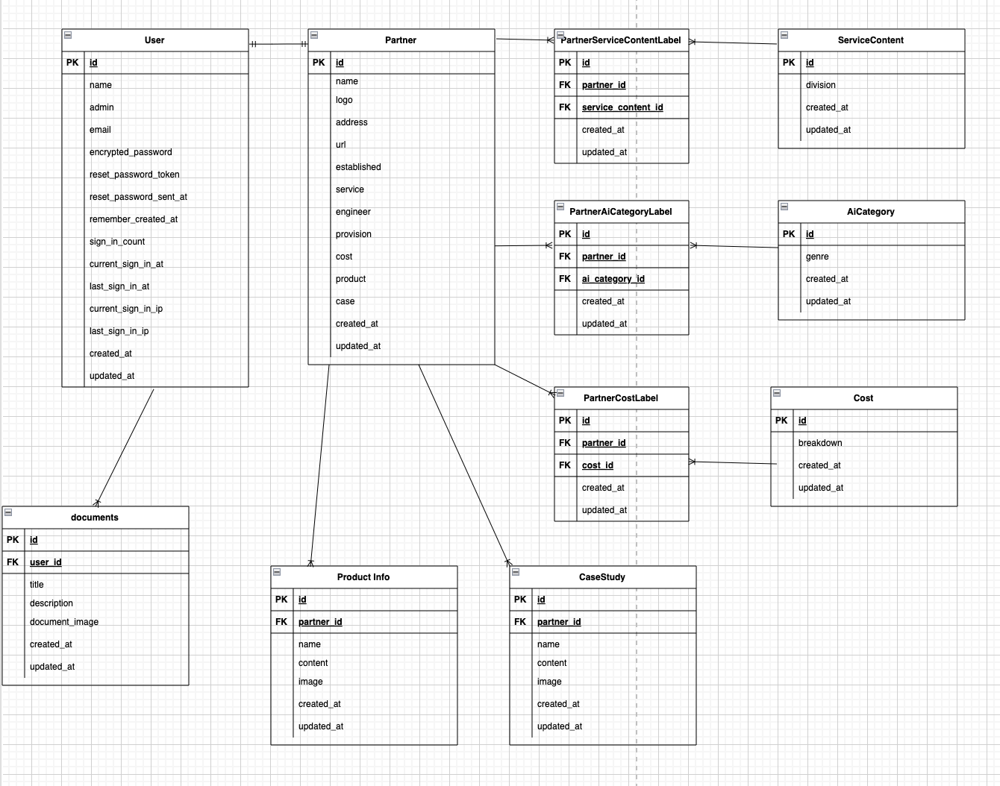
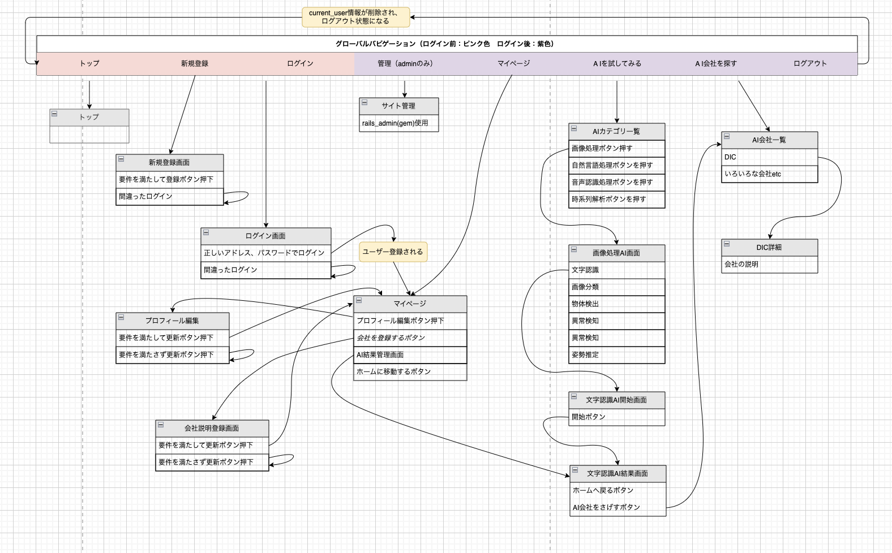

# README
## このアプリできること
* ユーザー登録
* OCR(文字認識機能)を試せる
* AI開発会社一覧から、自分が開発したい会社を探せる

## 開発言語
* Ruby 3.0.1
* Ruby on Rails 6.1.6

## 就業Termの技術
* Devise
* AWS EC2

## カリキュラム外の技術
* 読み込みたい画像を投入すると、結果を表示する機能。（Google Cloud Vision API）を使ってOCRを行う機能


## 実行手順
下記ターミナルで実行

```
$ git clone git@github.com:tsuru-ken/DIVE_INTO_AI.git
$ cd DIA
$ bundle
$ rails db:create db:migrate
$ rails db:seed
$ rails r db/seeds/
$ rails s
```

## カタログ設計, テーブル設計
https://docs.google.com/spreadsheets/d/1wcDMa9C4t7OmEOoayYDWm1n5VrKTVmpPa4uptG4-aJM/edit#gid=1666314801


## ワイヤーフレーム
draw.ioリンク
https://drive.google.com/file/d/1qyHD5-Jwz6td5vt99H2kDZWM3ozp57WT/view?usp=sharing

## ER図　
raw.ioリンク
https://drive.google.com/file/d/184uY-uuYTlHFZS6ao5c4Sky0D3UVyfsJ/view?usp=sharing


## 画面遷移図
draw.ioリンク
https://drive.google.com/file/d/1U4dy4ENPh661sTDGtwJl7VwjsYlE2cqf/view?usp=sharing
